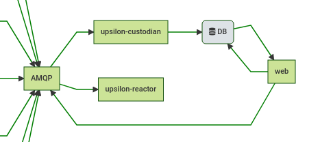

# upsilon-adaptor-mermaid

A simple microservice that exposes the logical graph of Upsilon nodes in
[Mermaid graph syntax](https://github.com/knsv/mermaid). Can be rendered by the
Grafana diagram plugin. 

